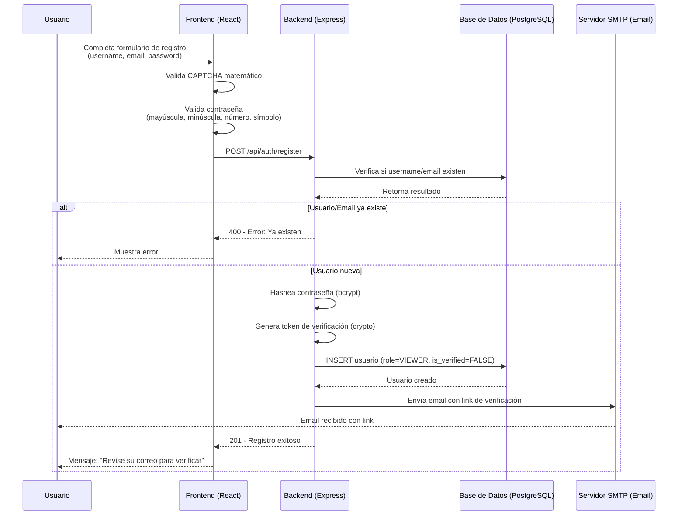
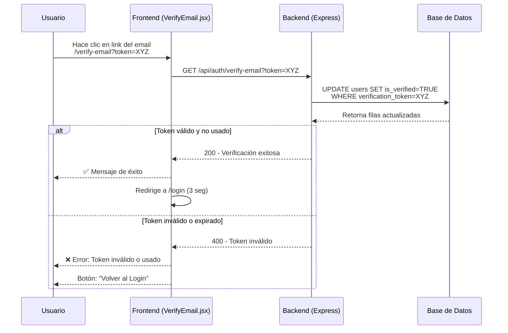
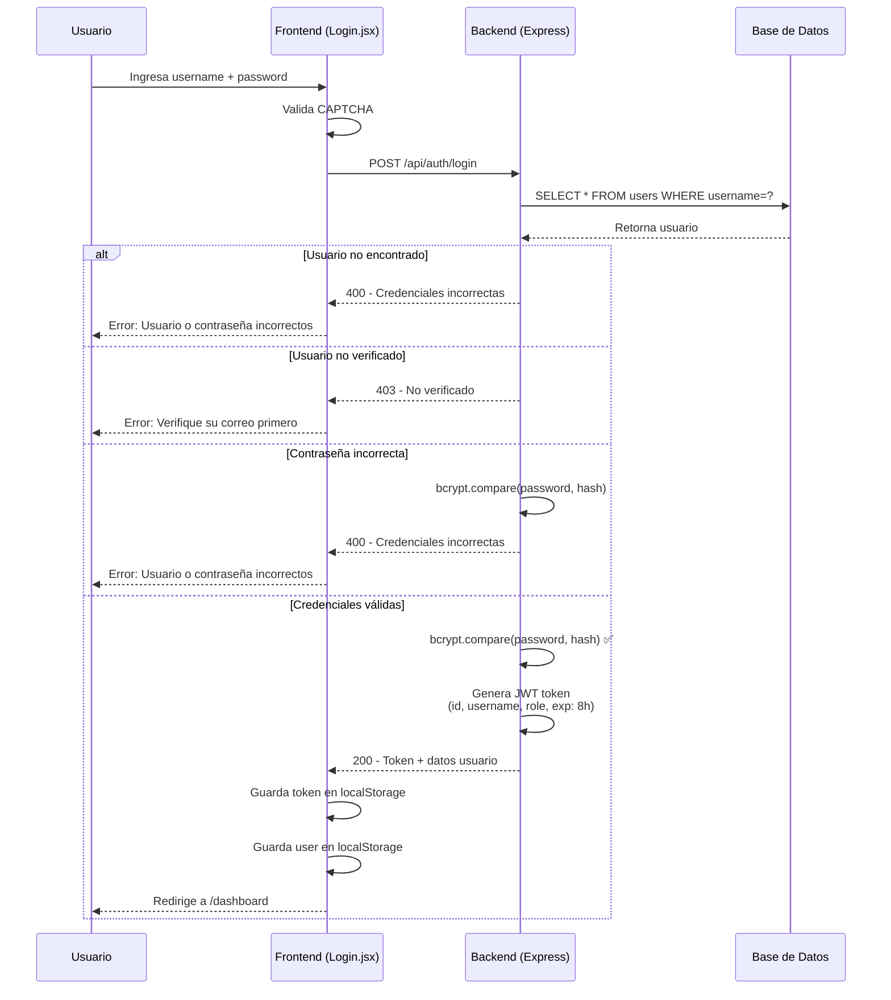
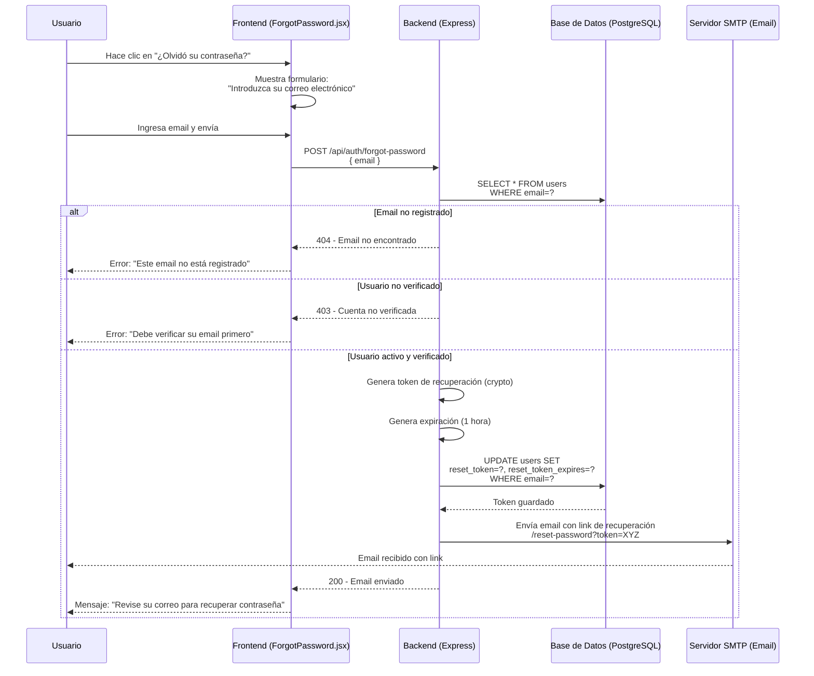
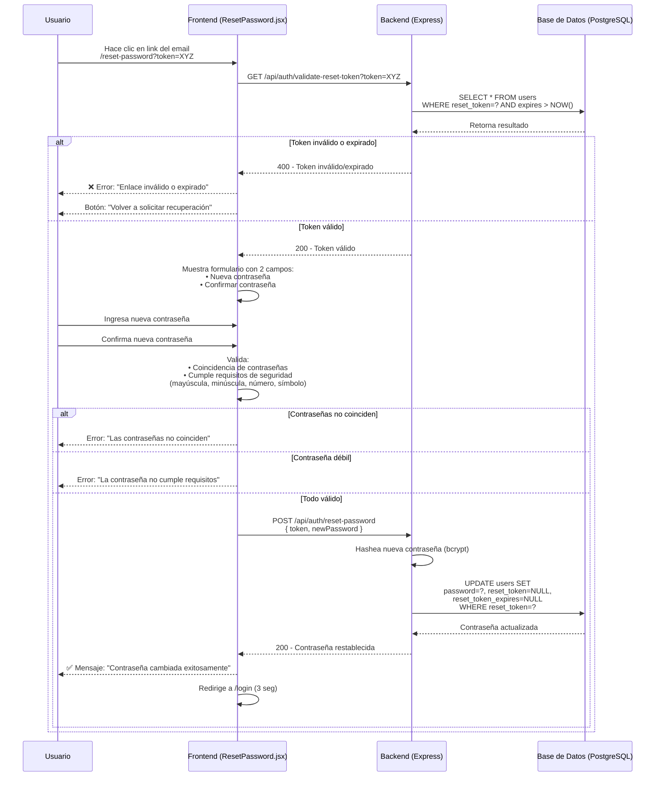
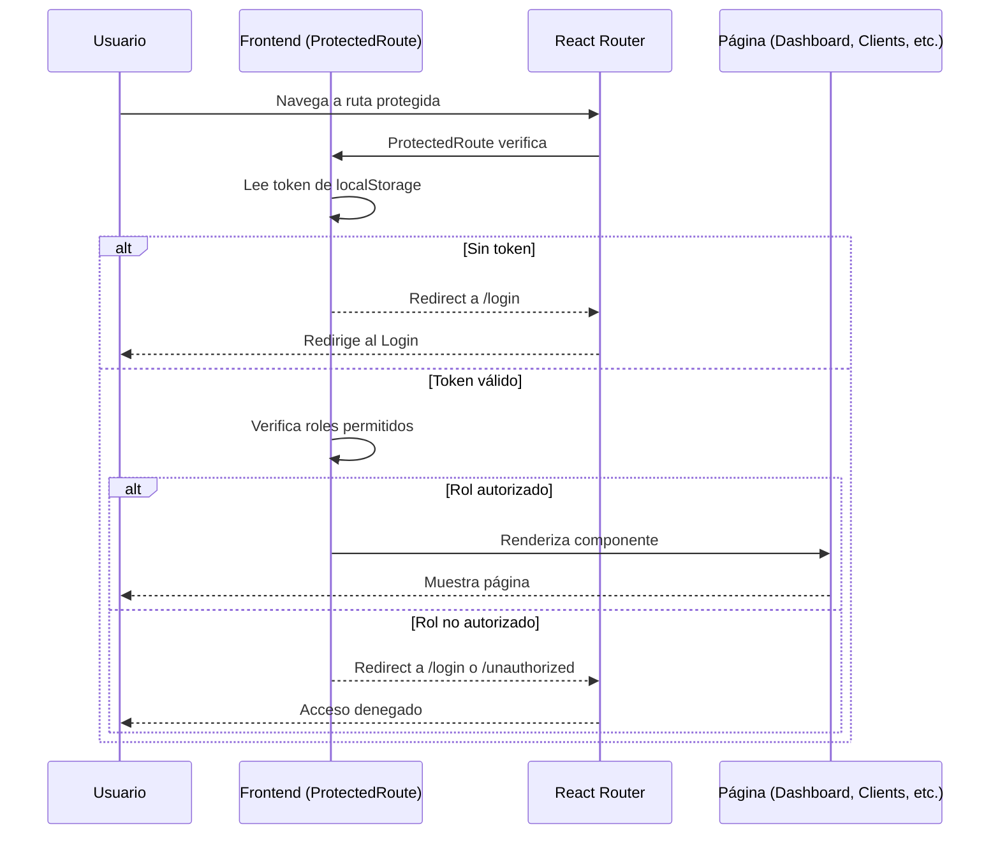
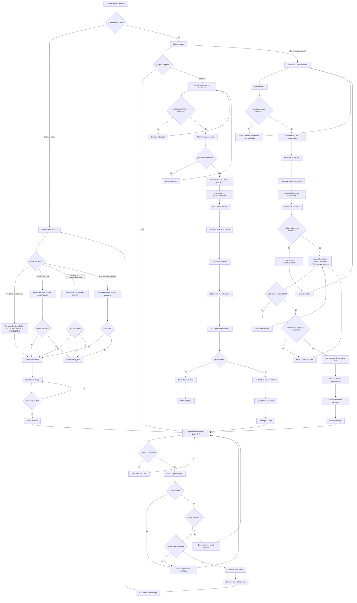

# Diagrama de Flujo - Sistema de Autenticación GELMA

## 1. Registro de Usuario

## 2. Verificación de Email

## 3. Login

## 4. Recuperación de Contraseña (Olvidé mi Contraseña)

### 4.1 Solicitud de Recuperación

### 4.2 Restablecimiento de Contraseña

## 5. Acceso a Rutas Protegidas

## 6. Diagrama de Flujo Completo (Visión General)

## 6. Roles y Permisos

### 6.1 Estructura de Roles

```mermaid
flowchart LR
    subgraph CONSULTOR["CONSULTOR (Viewer)"]
        CV1[Ver Dashboard]
        CV2[Ver Informes]
        CV3[Generar Reportes]
        CV4[Exportar Datos]
    end

    subgraph MODERADOR["MODERADOR"]
        CM1[Todos los permisos de Consultor]
        CM2[Validar Reportes]
        CM3[Aprobar/Rechazar Reportes]
        CM4[Consolidar Datos]
    end

    subgraph EDITOR["EDITOR (Empresa)"]
        CE1[Ver Dashboard]
        CE2[Ver Informes]
        CE3[Gestionar Clientes]
        CE4[Gestionar Productos]
        CE5[Gestionar Pedidos]
        CE6[Crear Reportes]
        CE7[Auditoría Obligatoria]
    end

    subgraph ADMIN["ADMINISTRADOR"]
        CA1[Control Total del Sistema]
        CA2[Validación de Cuentas]
        CA3[Ver Todos los Usuarios]
        CA4[Gestión de Usuarios]
        CA5[Gestión de Roles]
        CA6[Gestión Completa del Sistema]
    end

    CONSULTOR --> MODERADOR --> EDITOR --> ADMIN
```

### 6.2 Matriz de Permisos

| Permiso / Funcionalidad | Consultor | Moderador | Editor | Administrador |
|-------------------------|:---------:|:---------:|:------:|:-------------:|
| Ver Dashboard           | ✅ | ✅ | ✅ | ✅ |
| Ver Informes            | ✅ | ✅ | ✅ | ✅ |
| Generar Reportes        | ✅ | ✅ | ✅ | ✅ |
| Exportar Datos          | ✅ | ✅ | ✅ | ✅ |
| Validar Reportes        | ❌ | ✅ | ❌ | ✅ |
| Aprobar/Rechazar Reportes | ❌ | ✅ | ❌ | ✅ |
| Consolidar Datos        | ❌ | ✅ | ❌ | ✅ |
| Gestionar Clientes      | ❌ | ❌ | ✅ | ✅ |
| Gestionar Productos     | ❌ | ❌ | ✅ | ✅ |
| Gestionar Pedidos       | ❌ | ❌ | ✅ | ✅ |
| Crear Reportes          | ❌ | ❌ | ✅ | ✅ |
| Auditoría               | ❌ | ❌ | ✅ | ✅ |
| Validación de Cuentas   | ❌ | ❌ | ❌ | ✅ |
| Gestión de Usuarios     | ❌ | ❌ | ❌ | ✅ |
| Gestión de Roles        | ❌ | ❌ | ❌ | ✅ |
| Control Total del Sistema | ❌ | ❌ | ❌ | ✅ |

### 6.3 Descripción de Roles

#### **CONSULTOR (Viewer)**
- **Descripción:** Rol de solo lectura para consulta de información
- **Funciones principales:**
  - Visualización de Dashboard
  - Acceso a Informes y Estadísticas
  - Generación de Reportes
  - Exportación de datos (PDF, Excel)
- **Restricciones:** No puede crear, editar ni eliminar registros

#### **MODERADOR**
- **Descripción:** Rol intermedio con capacidad de validación
- **Funciones principales:**
  - Todos los permisos de Consultor
  - Validación de reportes antes de consolidar
  - Aprobación o rechazo de reportes
  - Consolidación de datos validados
- **Flujo de trabajo:** Los reportes creados por Editores pasan por validación del Moderador antes de ser consolidados

#### **EDITOR (Empresa)**
- **Descripción:** Rol operativo para gestión diaria del negocio
- **Funciones principales:**
  - CRUD completo de Clientes, Productos y Pedidos
  - Creación de reportes (sujeto a validación)
  - Auditoría obligatoria en todas las operaciones
- **Requisitos:** Todas las acciones quedan registradas en el sistema de auditoría

#### **ADMINISTRADOR**
- **Descripción:** Rol con control total del sistema
- **Funciones principales:**
  - Todos los permisos de los demás roles
  - Validación y aprobación de cuentas de usuarios
  - Gestión completa de usuarios (crear, editar, eliminar)
  - Asignación y modificación de roles
  - Configuración del sistema
  - Acceso a logs y auditoría completa

## 7. Componentes del Sistema

| Componente | Tecnología | Función |
|------------|------------|---------|
| Frontend | React + Vite | Interfaz de usuario |
| Backend | Express.js | API REST |
| Base de Datos | PostgreSQL | Almacenamiento persistente |
| Autenticación | JWT | Tokens de sesión (8h) |
| Encriptación | bcryptjs | Hash de contraseñas |
| Email | Nodemailer | Envío de verificación y recuperación |
| Seguridad | CAPTCHA matemático | Prevención de bots |
| Recuperación | Crypto | Tokens de recuperación de contraseña |

## 8. Endpoints de Autenticación

| Método | Endpoint | Acceso | Descripción |
|--------|----------|--------|-------------|
| POST | `/api/auth/register` | Público | Registra usuario y envía email |
| GET | `/api/auth/verify-email` | Público | Verifica token de email |
| POST | `/api/auth/login` | Público | Autentica y genera JWT |
| POST | `/api/auth/forgot-password` | Público | Envía email de recuperación |
| GET | `/api/auth/validate-reset-token` | Público | Valida token de recuperación |
| POST | `/api/auth/reset-password` | Público | Restablece contraseña |
| GET | `/api/users` | ADMIN | Lista todos los usuarios |
